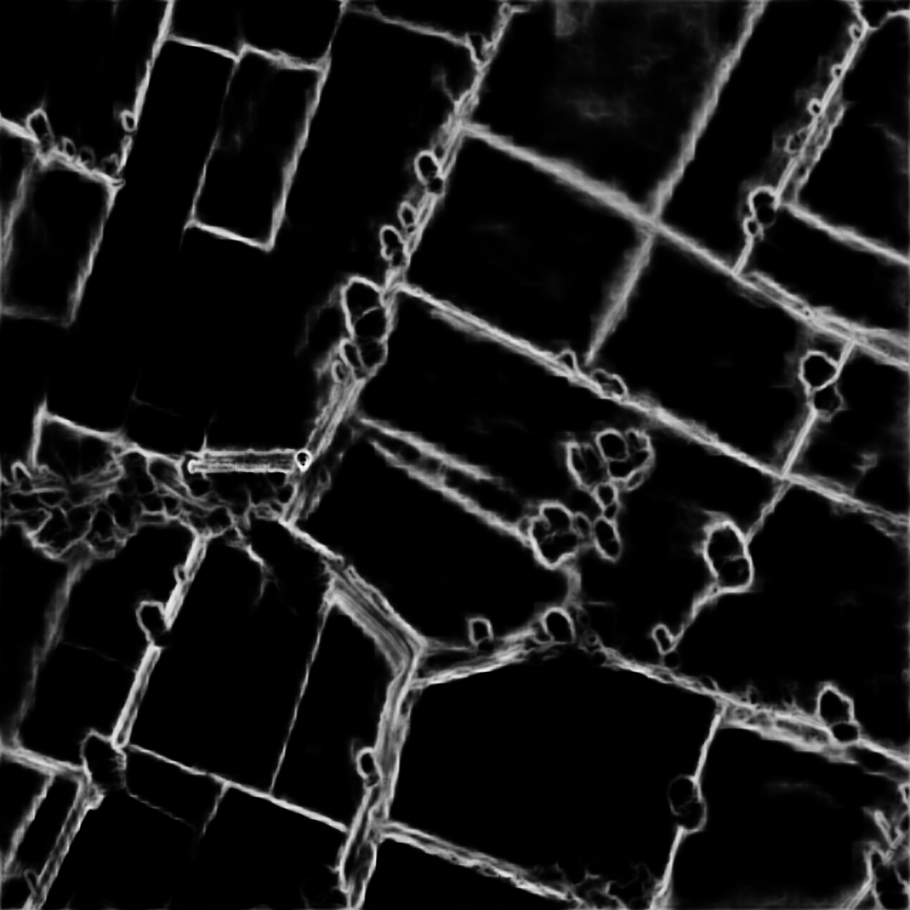

# SIH 2020
## Real time land usage monitoring tool using satellite data and artificial intelligence (P.S: NS275)
### Team Name- Shooting Stars

Our idea is to develop a crop monitoring system which doesn’t require any manual effort and eliminating the middlemen and the corruption while selling the yields. We will also act as a bridge between farmers and government so that government could help the farmers in need as quickly as possible. Farmers can use the platform to monitor weather conditions for minimizing related risks, plan and 
       manage field works to prevent losses. Vegetation Indices will be used for analysis of the field and 
       related information will be displayed for proper decision making and act as a supportive 
       mechanism for yield prediction. Insurers will be able to extract historical information about the field vegetation, climate/ weather 
       data, and assess land usage without visiting these fields as these can be easily monitored directly 
       from the platform. Both the website and mobile app will be bilingual i.e. English and Hindi so that both the it would be 
       suitable for all the farmers.

 For more information, you can refer to our presentation slides.
For ML model showcase video, you can scroll down.

**The website is deployed at -** [stubble-trouble.herokuapp.com](https://stubble-trouble.herokuapp.com) 

The members of the team are-  
Shriyansh, Prince, Prakash, Edwin, Pritika, Bharat  
**The images of the team members are uploaded in the folder team_image**

## ML Showcase Video

## Some Illustrations

### Scrapped Image

### HED Filtered Image

### Coordinates Marked

### Result

### Crop Predicted

## Wiki

Welcome to the SIH 2020 wiki!
1. Fork the Repo
2. Clone the Repo from the Fork - `git clone <link-from-fork>`
3. `git remote add upstream https://github.com/princebansal42/SIH2020.git`

Making Changes to Code
1. Create a branch 
Before pushing the code to Fork ,execute these commands to sync to the main repo
2. `git fetch upstream`
3. `git checkout master`
4. `git merge upstream/master`
